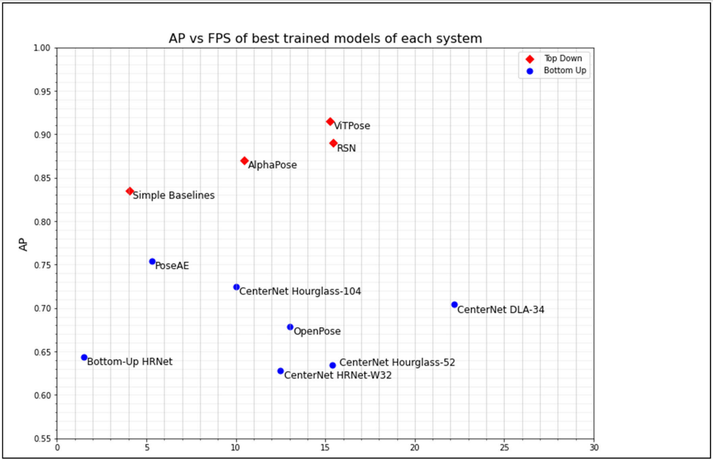

# Thermal-Human-Pose-Estimation

This repository contains the code and dataset from the following paper:

`J. Smith, P. Loncomilla and J. Ruiz-del-Solar, "Human Pose Estimation using Thermal Images," in IEEE Access, doi: 10.1109/ACCESS.2023.3264714.`

<b> Note that the dataset is available for research purposes only. Using it requires a reference to this paper.</b>

Please be sure to provide the required references if using code or data from any project specified below.

## UCH-ThermalPose Dataset

You can download the dataset used for the experiments from [google drive](https://drive.google.com/drive/folders/1YV7g563ZGlGO-9wx9G0vt6r7itJE8GDZ?usp=sharing). For further information about the dataset and its related structure, please consult our paper.

## Top-Down

Listed below, are all the top-down models used in the paper, along with their specific implementations used for the paper and performance metrics in the **UCH-ThermalPose Set-B dataset**.

| Model            | Source code                                                  | AP        | AR        |
| ---------------- | ------------------------------------------------------------ | --------- | --------- |
| ViTPose          | <https://github.com/ViTAE-Transformer/ViTPose>               | **0.915** | **0.941** |
| RSN              | <https://github.com/caiyuanhao1998/RSN>                      | 0.890     | 0.919     |
| AlphaPose        | <https://github.com/MVIG-SJTU/AlphaPose>                     | 0.870     | 0.909     |
| Simple Baselines | <https://github.com/microsoft/human-pose-estimation.pytorch> | 0.835     | 0.874     |
### Person Detector

As specified in the paper, all top-down methods were trained and evaluated using YOLOv7 as person detector. Specifically, we used the implementation that can be found at [YOLOv7 Github](https://github.com/WongKinYiu/yolov7.git).

## Bottom-Up

Listed below, are all the bottom-up models used in the paper, along with their specific implementations used for the paper and performance metrics in the **UCH-ThermalPose Set-B dataset**.

| Model                      | Source code                                                     | AP        | AR        |
| -------------------------- | --------------------------------------------------------------- | --------- | --------- |
| CenterNet (HRNet backbone) | <https://github.com/jsmithdlc/Thermal-Human-Pose-Estimation> \* | 0.795     | **0.864** |
| Bottom-Up HRNet            | <https://github.com/HRNet/HRNet-Bottom-Up-Pose-Estimation>      | 0.662     | 0.762     |
| PoseAE                     | <https://github.com/princeton-vl/pose-ae-train>                 | 0.759     | 0.840     |
| OpenPose                   | <https://github.com/CMU-Perceptual-Computing-Lab/openpose>      | **0.806** | 0.849     |

\* *CenterNet source code is a fork from the [original repository](https://github.com/xingyizhou/CenterNet.git) with changes to accomodate the HRNet backbone, freezing schemes, among other.*

## Reference

    @article{javiersmith2023,
        title={Human Pose Estimation using Thermal Images},
        author={Javier Smith and Patricio Loncomilla and Javier Ruiz-del-Solar},
        journal={IEEE Access},
        url={https://www.doi.org/10.1109/ACCESS.2023.3264714},
        year={2023},
    }